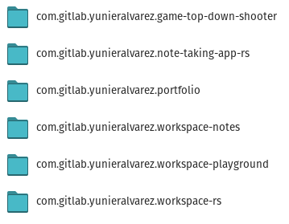

## Hi there 👋

### Portfolio

#### `cgit`

Wraps `git clone` for organizing project folders in a reverse domain-like structure. Built with Rust.

[Source Code](https://gitlab.com/yunieralvarez/cgit)

<!--
spell-checker: disable
**eunier/eunier** is a ✨ _special_ ✨ repository because its `README.md` (this file) appears on your GitHub profile.

Here are some ideas to get you started:

- 🔭 I’m currently working on ...
- 🌱 I’m currently learning ...
- 👯 I’m looking to collaborate on ...
- 🤔 I’m looking for help with ...
- 💬 Ask me about ...
- 📫 How to reach me: ...
- 😄 Pronouns: ...
- ⚡ Fun fact: ...
spell-checker: enable
-->
